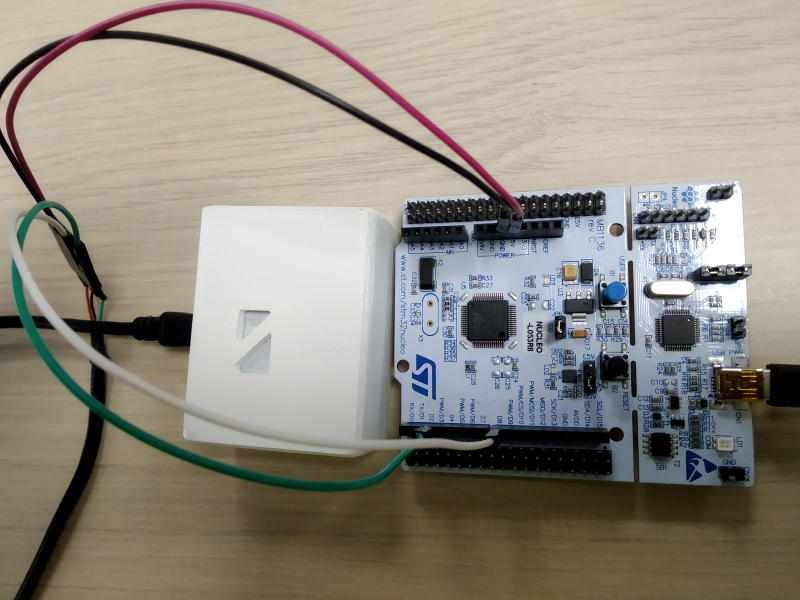

Elichens Foxberry sensor's driver
============================

This project contains a C driver for Elichens' Foxberry sensor (CO2 / CH4) and code samples
that illustrate how to use it on various platforms:

 * Arduino
 * STM32 (as an example: Nucleo L053R8)

The provided projects use the same version of the driver, yet for convenient reasons files have
a .cpp extension in the `eLichens_arduino/` folder and .c in the `eLichens_stm32/lib/` folder.

## Setup

### USB cable

To connect a dev board to Elichens sensor, you'll need to prepare a mini-USB cable:

 * One side is the mini-USB part and will connect to the Elichens' device with the sensor
 * One side need to be cut to get access to the wires (red, black, green and white)

In the picture, we use a basic header + cables to connect those wires the arduino / nucleo / any
other board.


### Arduino setup

The Arduino sample project uses a `SoftwareSerial` to communicate with the Elichens' sensor with
PINs 6 and 7 (so that the USB `Serial` can be used for logs, at 115200 bauds).

In the picture below:

* RED goes to 5V
* BLACK goes to GND
* GREEN goes to PIN7 (Rx)
* WHITE goes to PIN6 (Tx)


### STM32 setup

The stm32 project is coded for a Nucleo L053R8 but can easily be adapted.

This repository does not include the `Drivers` folder with `CMSIS` and `HAL` code.
To make it work, you'll need to initiate a CubeMX project configured for your board,
then copy/paste the sources from this repository.

In the picture below:

* RED goes to 5V
* BLACK goes to GND
* GREEN goes to D8 (USART1 Rx)
* WHITE goes to PIN6 (USART1 Tx)



Logs will be available through the USB serial (USART2) at 115200 bauds.

## Expected results

The provided projects simply test the sensor:

* First it reads static information (sensor's name, serial number, etc.) and logs to USB
* Then it reads the sensor's data indefinitely every second

Here is an example of what should be read using a Serial console:

```
18:10:51.662 -> Model name: FOXBERRY-20
18:10:51.866 -> Product name: eLichens NDIR
18:10:52.073 -> Firmware version: V0.20D
18:10:52.280 -> Serial number: 5870075
18:10:52.484 -> Sensor's name: CH4NB
18:10:52.934 -> time = 16 ; ppm = 0 ; degC = 23.00
18:10:53.964 -> time = 17 ; ppm = 0 ; degC = 23.00
18:10:53.964 -> time = 18 ; ppm = 0 ; degC = 23.00
```

## Going further

To write your own code using Elichens sensor with this driver, according to `ELICHENS_Sensor_t` struct,
you need to define some callbacks dedicated to your hardware that deals with your UART properly.

```c
// Prototype for our UART communication
ELCOM_errorCode_t el_uartTransmit(uint8_t *data, uint16_t size);
ELCOM_errorCode_t el_uartReceive(uint8_t *data);
ELCOM_errorCode_t el_uartWaitUntilReceived(void);
void el_uartAbortReceive(void);

// Define our sensor
ELICHENS_Sensor_t sensor = {
  .uartTransmit = &el_uartTransmit,
  .uartReceive = &el_uartReceive,
  .uartWaitUntilReceived = &el_uartWaitUntilReceived,
  .uartAbortReceive = &el_uartAbortReceive,
};
```

### Callback `uartTransmit(data, size)`

```c
ELCOM_errorCode_t (*uartTransmit)(uint8_t *data, uint16_t size)
```

This function must transmit an array of bytes through the sesor's uart. Here are the serial specifications:

* Baud rate: 57600 bits/s
* Word length: 8 Bits
* Parity: none
* Stop bits: 1

### Callback `uartReceive(*data)`

```c
ELCOM_errorCode_t (*uartReceive)(uint8_t *data)
```

This function must activate the reception of data from the sensor's uart so that incoming bytes are stored into our buffer (unkown size < `ELCOM_DATA_BUFFER_SIZE`). It must be non-blocking, for instance using an interruption-based reception.

### Callback `uartWaitUntilReceived()`

```c
ELCOM_errorCode_t (*uartWaitUntilReceived)(void)
```

As the previous function is non-blocking, this one is.

The size of incoming data cannot be known in advance so we need to inspect it as we receive it
(that size can be known when we have received the 1st bytes).

* The code examples provided here are very basic: we keep calling a utility function `ELCOM_isResponseComplete(sensor.bufferRx)` until it returns `true`.
* In a more advanced usage, for instance with FreeRTOS and low power management, we could rely on a semaphore released by the uart IT to unblock the code...

Yet here it is quite important to handle a **timeout** somehow (see examples).

### Callback `uartAbortReceive()`

```c
void (*uartAbortReceive)(void)
```

This function must stop the reception, in opposition to `uartReceive(*data)`. It will be called after `uartWaitUntilReceived()` either on a message received, either on a timeout.
